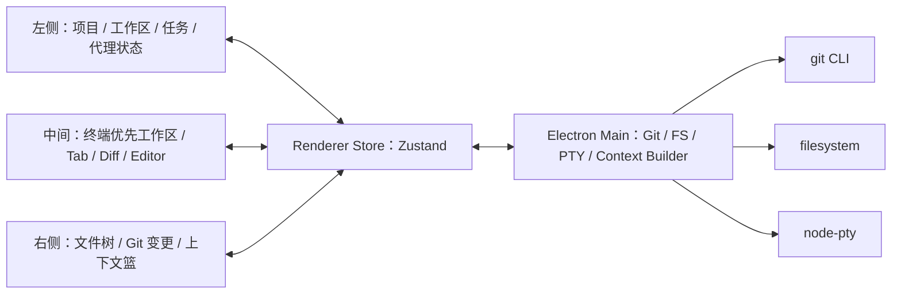

# AI 编码工具产品手册

版本：0.1  
日期：2026-04-25  
工作名：ForgePad

## 1. 产品定位

ForgePad 是一个本地优先的 AI 编码桌面软件。它把终端作为主工作区，把项目、任务、工作区放在左侧，把文件树、Git 变更、AI 上下文篮放在右侧。用户可以在同一个界面里启动 AI 编码代理、查看文件树、阅读 diff、选择多个文件或 diff 行评论作为上下文，然后一次性发送给 AI。

核心目标：

1. 让用户不用离开终端也能管理 AI 编码任务。
2. 使用 `@pierre/trees` 提供高性能、带 Git 状态的文件树。
3. 使用 `@pierre/diffs` 提供清晰、可评论、可选中、可虚拟滚动的 diff 视图。
4. 支持多文件、多评论、多变更作为 AI 上下文一起发送。
5. 保持本地优先：项目路径、终端、文件内容和 Git 操作都先在本机处理。

## 2. 参考项目结论

### 2.1 constellagent

适合作为整体骨架参考。

可借鉴点：

1. Electron + React + Zustand + xterm + node-pty 的桌面架构。
2. 三栏布局：左侧项目/工作区，中间 tab/终端/编辑器/diff，右侧文件和变更。
3. `@pierre/trees/react` 的实际使用方式：把服务端树结构 flatten 成 paths，再传给 `useFileTree`。
4. `@pierre/diffs/react` 的轻量使用方式：用 `PatchDiff` 渲染每个文件 patch。
5. 终端生命周期策略：所有终端保持挂载，只用可见性切换，避免 TUI 状态和 scrollback 丢失。
6. Zustand 单 store：`projects -> workspaces -> tabs`，状态清晰、适合 MVP。

需要增强的点：

1. 文件树只支持单选打开文件，暂不支持把文件加入 AI 上下文。
2. diff 视图没有行评论和上下文发送流程。
3. Git status 解析使用 porcelain v1，重命名、冲突、多状态文件可以更稳。
4. 文件读写和路径校验还需要参考 Orca 的安全处理。

### 2.2 open-warden

适合作为 diff、评论、选择模型参考。

可借鉴点：

1. `selectedFiles` + `selectionAnchor` 支持普通点击、Cmd/Ctrl 多选、Shift 范围选择。
2. `CommentItem` 把评论锚定在 repo、file、bucket、line range、diff side 上。
3. `copyComments("file" | "all")` 可以把多个评论整理成结构化文本并清空已处理评论。
4. `@pierre/diffs` 的高级用法：`FileDiff`、`Virtualizer`、`lineAnnotations`、`selectedLines`、自定义 annotation renderer。
5. diff 大文件保护、解析 worker、缓存和虚拟滚动值得直接采用。

需要调整的点：

1. open-warden 是 source-control 产品，不是终端驱动的 AI 编码工具，需要把“复制评论”升级为“发送上下文给 AI”。
2. open-warden 自己实现了文件树；我们应优先用 `@pierre/trees`。

### 2.3 orca

适合作为本地 relay、文件系统、Git 操作安全边界参考。

可借鉴点：

1. 所有 filesystem/git 操作都绑定到授权 workspace root。
2. 对 symlink、路径穿越、二进制文件、大文件做保护。
3. Git 操作用 `execFile` 和 `--` 分隔路径参数，避免 shell 注入。
4. 批量 stage/unstage 按 chunk 执行，避免命令参数过长。
5. 搜索优先 `rg`，不可用时 fallback 到 git/readdir。

### 2.4 superset

适合作为上下文编排和长期架构参考。

可借鉴点：

1. `LaunchSource` / `ContextSection` / `LaunchContext` 的多来源上下文抽象。
2. 上下文 contributor 可以并发解析、超时、失败隔离。
3. 明确区分用户 prompt、任务、issue、PR、附件等来源。
4. host-service event bus 可以统一推送 fs、git、agent、terminal lifecycle。

MVP 中的取舍：

1. 初版先做单机 Electron IPC，不上云 host-service。
2. 上下文模型保留 superset 的抽象思想，先落地到本地 Zustand + main process service。

## 3. 核心用户

主要用户：

1. 经常使用 Claude Code、Codex、Gemini CLI、Crush、Aider 等终端 AI 编码工具的开发者。
2. 希望同时管理多个项目、多个 worktree、多个 AI 任务的开发者。
3. 需要把文件、diff、评论、任务描述一起发给 AI 的开发者。

关键痛点：

1. 终端里 AI 工作很强，但选择文件、查看 diff、组织上下文很麻烦。
2. 编辑器里可以选文件，但 terminal AI 和 Git diff 常常割裂。
3. 多个 AI 任务并行时，不知道哪个项目、哪个 worktree、哪个代理正在工作。
4. 给 AI 发送上下文经常靠手动复制粘贴，容易漏文件、漏评论、漏行号。

## 4. 产品原则

1. 终端优先：中间主区域默认是终端，不做“聊天软件伪装 IDE”。
2. 上下文显式：只有用户选中的文件、变更、评论、任务会进入 AI 上下文。
3. 本地安全：所有文件读写、Git 操作、终端启动都限定在 workspace root。
4. 少装饰、高密度：界面像 Linear / VS Code 侧栏一样克制，适合长时间工作。
5. 可追溯：每次发送给 AI 的上下文都生成一份 bundle 记录，方便复用和排查。
6. 渐进增强：MVP 支持终端代理；后续再接 OpenAI/Anthropic API 原生聊天。

## 5. 信息架构



## 6. 主界面布局

### 6.1 左侧栏

左侧栏负责“要在哪个项目/任务里工作”。

模块：

1. 顶部项目切换器
   - 打开本地文件夹。
   - 显示最近项目。
   - 项目级设置：默认 AI 命令、启动命令、忽略规则。

2. Workspaces / Worktrees
   - 根 workspace：项目原始目录。
   - 派生 workspace：Git worktree。
   - 显示分支名、变更数量、AI 活跃状态、未读状态。
   - 右键操作：新建终端、新建 worktree、重命名、删除、打开 Finder、复制路径。

3. Tasks
   - 手动创建任务。
   - 每个任务可绑定 workspace。
   - 状态：Backlog、Ready、Running、Review、Done。
   - 任务可以直接生成 AI prompt。

4. Agent Runs
   - 当前正在运行的 AI 终端。
   - 显示代理类型、运行中/等待用户/完成/失败。
   - 点击可跳转对应 terminal tab。

### 6.2 中间主区域

中间是主要工作区，默认打开终端。

Tab 类型：

1. Terminal
   - xterm 渲染。
   - node-pty 在 main process 中管理。
   - 每个 workspace 可有多个 terminal tab。
   - 终端 tab 不活跃时保持挂载。

2. Diff
   - 使用 `@pierre/diffs` 渲染当前 workspace 的 Git 变更。
   - 支持 split / unified。
   - 支持文件跳转条。
   - 支持选中 diff 行并添加评论。

3. File
   - Monaco 编辑器打开文件。
   - 初版支持 read/write/save。
   - 后续支持 LSP、go to definition、symbol peek。

4. Context Preview
   - 发送前预览本次 AI 上下文。
   - 显示 token 估算、文件数量、评论数量、变更数量。
   - 可删除某个上下文项。

### 6.3 右侧栏

右侧栏负责“要把什么交给 AI”。

Tab：

1. Files
   - 使用 `@pierre/trees/react`。
   - 支持搜索、展开/折叠、flatten empty directories。
   - 显示 Git status badge。
   - 单击打开文件。
   - Cmd/Ctrl 点击加入/移出上下文。
   - Shift 点击范围选择多个文件。
   - 右键：Open、Add to Context、Add Directory to Context、Copy Path、Copy Relative Path。

2. Changes
   - 显示 staged / unstaged / untracked。
   - 支持 stage、unstage、discard、commit。
   - 点击打开 diff tab 并定位文件。
   - Cmd/Ctrl 多选变更加入上下文。
   - 支持“Add All Changes to Context”。

3. Context
   - 上下文篮。
   - 分组显示：Prompt、Files、Diffs、Comments、Task、Attachments。
   - 每项显示大小、来源、是否会被截断。
   - 支持 reorder、remove、collapse。
   - 一键发送到当前 AI terminal。

## 7. 关键工作流

### 7.1 打开项目并启动 AI

1. 用户点击 Open Folder。
2. main process 校验路径是否存在、是否 Git repo。
3. 创建 Project 和 Root Workspace。
4. 自动创建一个 Terminal tab。
5. 用户选择 Agent Preset，例如 `codex`、`claude`、`gemini`、`custom`。
6. App 在 workspace root 启动 PTY。
7. 终端显示在中间。

验收：

1. 关闭重开应用后项目、workspace、tab 恢复。
2. 如果 terminal 进程已退出，tab 显示可重启状态。
3. 非 Git 项目也能打开，但 Changes tab 显示非 Git 状态。

### 7.2 多文件作为 AI 上下文

1. 用户在右侧 Files 中 Cmd/Ctrl 点击多个文件。
2. 选中文件进入 Context tab 的 Files 分组。
3. 用户可给每个文件补一句说明，例如“重点看这个 hook 的状态流”。
4. 用户在 composer 中写 prompt。
5. 点击 Send to Terminal。
6. App 生成 Context Bundle：
   - prompt 文本
   - 文件相对路径
   - 文件内容或摘要
   - 用户对文件的说明
   - token/字符预算信息
7. 对 terminal agent：
   - 把 bundle 写到 `.forgepad/context/<runId>.md`
   - 在终端输入一段简短 prompt，提示 AI 阅读该 context 文件
   - 如 agent 支持 stdin prompt，则直接 bracketed paste 发送

验收：

1. 至少支持 20 个小文件一起发送。
2. 大文件自动截断并在 preview 中标注。
3. 二进制文件不读取文本内容，只作为路径引用。
4. 文件路径统一使用 workspace 相对路径。

### 7.3 多个 diff 评论一起发送

1. 用户打开 Diff tab。
2. 在 `@pierre/diffs` 视图里拖选一段行范围。
3. 行下方出现 Comment Composer。
4. 用户输入评论，例如“这个分支判断可能漏了空数组”。
5. 评论锚定到文件、bucket、side、startLine、endLine。
6. 用户继续在多个文件上添加评论。
7. Context tab 显示 Comments 分组。
8. 用户点击 Send Comments + Selected Files。
9. App 组合上下文：
   - 每条评论
   - 评论所在文件 path 和行号
   - 若该文件已选中，则带完整/截断文件内容
   - 若未选中，则带 diff hunk 摘要

发送格式示例：

```text
# User comments

## src/auth/session.ts
- L42-L49 additions: 这个分支判断可能漏了空数组

## src/hooks/useTasks.ts
- L18 deletions-L24 additions: 这里的 loading 状态和缓存失效顺序要确认
```

验收：

1. 评论可以跨多个文件累计。
2. 发送后默认保留评论，用户可选择发送后清空。
3. 评论行号在 split/unified diff 下都能正确锚定。
4. 文件重命名时保留 previousPath。

### 7.4 Git 变更查看

1. 用户进入右侧 Changes。
2. App 调用 `git status --porcelain=v2 --untracked-files=all`。
3. 点击某文件打开中心 Diff tab。
4. Diff tab 调用 main process 获取 old/new 内容或 patch。
5. `@pierre/diffs` 渲染 diff。
6. 文件过大时显示保护提示。

验收：

1. 支持 staged、unstaged、untracked、deleted、renamed。
2. 支持大文件保护、二进制文件提示。
3. 支持 split / unified 切换。
4. 支持文件跳转和当前文件高亮。

### 7.5 任务驱动 worktree

1. 用户在左侧 Tasks 新建任务。
2. 选择“Create Workspace”。
3. App 根据任务标题生成分支名。
4. 调用 `git worktree add` 创建工作区。
5. 创建 terminal tab 并启动 AI agent。
6. 任务状态变为 Running。

验收：

1. 分支名安全转义。
2. 已存在分支/worktree 有明确冲突提示。
3. worktree 删除前检查 dirty 状态。

## 8. 数据模型

### 8.1 Project

```ts
type Project = {
  id: string;
  name: string;
  repoPath: string;
  defaultAgentId?: string;
  startupCommands: StartupCommand[];
  createdAt: number;
  updatedAt: number;
};
```

### 8.2 Workspace

```ts
type Workspace = {
  id: string;
  projectId: string;
  name: string;
  branch: string;
  worktreePath: string;
  isRoot: boolean;
  taskId?: string;
  createdAt: number;
};
```

### 8.3 Tab

```ts
type Tab =
  | { id: string; workspaceId: string; type: "terminal"; title: string; ptyId: string }
  | { id: string; workspaceId: string; type: "file"; filePath: string; unsaved?: boolean }
  | { id: string; workspaceId: string; type: "diff"; activePath?: string }
  | { id: string; workspaceId: string; type: "context-preview"; bundleId?: string };
```

### 8.4 Context Item

```ts
type ContextItem =
  | {
      id: string;
      type: "file";
      workspaceId: string;
      relPath: string;
      note?: string;
      includeContent: boolean;
      addedAt: number;
    }
  | {
      id: string;
      type: "diff";
      workspaceId: string;
      relPath: string;
      bucket: "staged" | "unstaged" | "untracked";
      note?: string;
      addedAt: number;
    }
  | {
      id: string;
      type: "comment";
      workspaceId: string;
      relPath: string;
      bucket: "staged" | "unstaged" | "untracked";
      side: "additions" | "deletions";
      startLine: number;
      endLine: number;
      text: string;
      addedAt: number;
    }
  | {
      id: string;
      type: "task";
      taskId: string;
      addedAt: number;
    };
```

### 8.5 Context Bundle

```ts
type ContextBundle = {
  id: string;
  workspaceId: string;
  prompt: string;
  items: ContextItem[];
  renderedMarkdownPath?: string;
  estimatedTokens: number;
  createdAt: number;
  sentAt?: number;
};
```

## 9. 主技术架构

### 9.1 推荐技术栈

1. Desktop：Electron + electron-vite。
2. Renderer：React 19 + TypeScript。
3. State：Zustand，MVP 单 store；后续可拆 slices。
4. Layout：Allotment 或 react-resizable-panels。
5. Terminal：`@xterm/xterm` + `@xterm/addon-fit` + `node-pty`。
6. Editor：Monaco。
7. Diff：`@pierre/diffs`。
8. Tree：`@pierre/trees`。
9. File search：`rg` 优先，fallback 到 git/readdir。
10. Persistence：初版 JSON 文件；后续 SQLite。

### 9.2 Main Process 服务

必须拆成这些 service：

1. `GitService`
   - status
   - diff
   - branch diff
   - stage / unstage / discard / commit
   - worktree list / create / remove

2. `FileService`
   - read file
   - write file
   - list tree
   - list files
   - search
   - watch

3. `PtyService`
   - create
   - write
   - resize
   - destroy
   - reattach / replay

4. `ContextService`
   - resolve selected context items
   - read file contents safely
   - render markdown bundle
   - estimate size
   - write bundle to workspace

5. `StateService`
   - load app state
   - save app state
   - migrate schema version

### 9.3 Renderer Store

Store 模块：

1. Projects slice
2. Workspaces slice
3. Tabs slice
4. Right panel slice
5. Git snapshot slice
6. Context basket slice
7. Comments slice
8. Agent runs slice
9. Settings slice

MVP 可以先用一个 Zustand store，但代码文件上按 action 分组。

## 10. `@pierre/trees` 集成规范

输入：

```ts
type TreeInput = {
  paths: string[];
  gitStatus: Array<{
    path: string;
    status: "modified" | "added" | "deleted" | "renamed" | "untracked";
  }>;
};
```

生成方式：

1. main process 用 `git ls-files --others --cached --exclude-standard` 获取文件。
2. 加上可选的 `.env*` 文件。
3. renderer 转换成 workspace 相对路径。
4. 目录 path 以 `/` 结尾。
5. 文件 path 不以 `/` 结尾。
6. Git 状态从 `git status` 合并到 file tree。
7. 父目录若有子文件变更，显示 modified 状态。

交互要求：

1. 单击文件：打开 file tab。
2. Cmd/Ctrl 点击文件：toggle context selection。
3. Shift 点击文件：范围选择。
4. 右键文件：Open、Add to Context、Copy Path、Copy Relative Path。
5. 右键目录：Add Directory to Context、Copy Path、Refresh。
6. 搜索过滤时，选择逻辑仍保留原始 path。

## 11. `@pierre/diffs` 集成规范

MVP 两级实现：

1. 第一阶段：使用 `PatchDiff` 快速渲染 patch。
2. 第二阶段：使用 `FileDiff` + `Virtualizer` + worker parsing，支持大 diff、注释、行选择。

Diff 数据来源：

1. staged：`git diff --staged -- path`
2. unstaged：`git diff -- path`
3. untracked：读取文件内容，生成 synthetic patch，或用 old/new content 模式。
4. deleted：用 `HEAD:path` 和空内容生成 diff。
5. renamed：保留 oldPath / previousPath。

交互要求：

1. split / unified 切换。
2. 文件 header sticky。
3. 文件列表跳转。
4. 行范围选择。
5. 行评论 composer。
6. 评论 annotation 渲染。
7. 大 diff 默认不渲染，点击后再强制渲染。
8. 二进制文件显示提示。

## 12. AI 上下文发送规范

### 12.1 上下文来源

```ts
type LaunchSource =
  | { kind: "user-prompt"; text: string }
  | { kind: "selected-file"; relPath: string; note?: string }
  | { kind: "selected-diff"; relPath: string; bucket: string; note?: string }
  | { kind: "diff-comment"; commentId: string }
  | { kind: "task"; taskId: string }
  | { kind: "attachment"; filePath: string };
```

### 12.2 上下文渲染顺序

1. User Prompt
2. Task
3. Selected Files
4. Selected Diffs
5. Diff Comments
6. Attachments
7. Workspace metadata

### 12.3 终端发送策略

初版推荐：

1. 渲染完整上下文到 `.forgepad/context/<timestamp>-<runId>.md`。
2. 给 terminal 写入：

```text
Please read .forgepad/context/<timestamp>-<runId>.md and complete the task described there.
```

3. 对支持直接 prompt 的 agent，可配置 command template：

```text
codex "{{prompt}}"
claude "{{prompt}}"
gemini "{{prompt}}"
```

4. 大上下文一律走 context 文件，避免终端粘贴不稳定。

### 12.4 Context Bundle Markdown 结构

```text
# ForgePad Context

## User Prompt
...

## Workspace
- Project: ...
- Branch: ...
- Root: ...

## Selected Files
### src/foo.ts
User note: ...
```ts
...
```

## Selected Diffs
### src/bar.ts unstaged
```diff
...
```

## Comments
### src/baz.ts
- L10-L18 additions: ...
```

## 13. 安全与限制

必须实现：

1. main process 所有路径先 resolve，再检查是否在 workspace root 内。
2. 禁止读取超过默认 1 MB 的文本文件进入上下文，除非用户确认。
3. 二进制文件只作为引用，不进入文本上下文。
4. discard、delete worktree、delete project 必须确认。
5. Git 命令使用 `execFile`，路径参数放在 `--` 后。
6. symlink 需要用 realpath 校验，避免跳出 workspace。
7. watch 数量限制，避免打开太多 watcher。
8. 上下文 bundle 写入 `.forgepad/context/`，默认加入 `.gitignore` 提示。

## 14. 设置项

MVP 设置：

1. Default shell
2. Default agent command
3. Terminal font size
4. Editor font size
5. Diff style：split / unified
6. Context file size limit
7. Send behavior：send and keep comments / send and clear comments
8. Auto start terminal on workspace open
9. Restore previous session

## 15. MVP 范围

必须有：

1. 打开本地项目。
2. 创建 root workspace。
3. 中间 terminal tab。
4. 右侧 `@pierre/trees` 文件树。
5. 右侧 changes list。
6. 中间 `@pierre/diffs` diff tab。
7. 多文件选择加入上下文。
8. diff 行评论加入上下文。
9. Context tab 预览并发送到 terminal。
10. 基础 Git 操作：stage、unstage、discard、commit。
11. 状态持久化。

暂缓：

1. 云同步。
2. 多设备 host-service。
3. GitHub PR review 写回。
4. LSP。
5. 原生模型 API 聊天。
6. 自动化定时任务。

## 16. 验收总清单

1. 打开一个 Git 项目后，文件树能显示并带 Git 状态。
2. 修改文件后，Changes 自动刷新。
3. 点击 changed file 能打开 diff。
4. diff 可 split/unified 切换。
5. 用户能 Cmd/Ctrl 选择多个文件加入上下文。
6. 用户能在多个 diff 文件上添加评论。
7. Context tab 能显示所有选中文件和评论。
8. 发送到 terminal 后，workspace 下生成 context markdown。
9. Terminal 中收到指向 context markdown 的 prompt。
10. 重启应用后项目、workspace、设置恢复。

