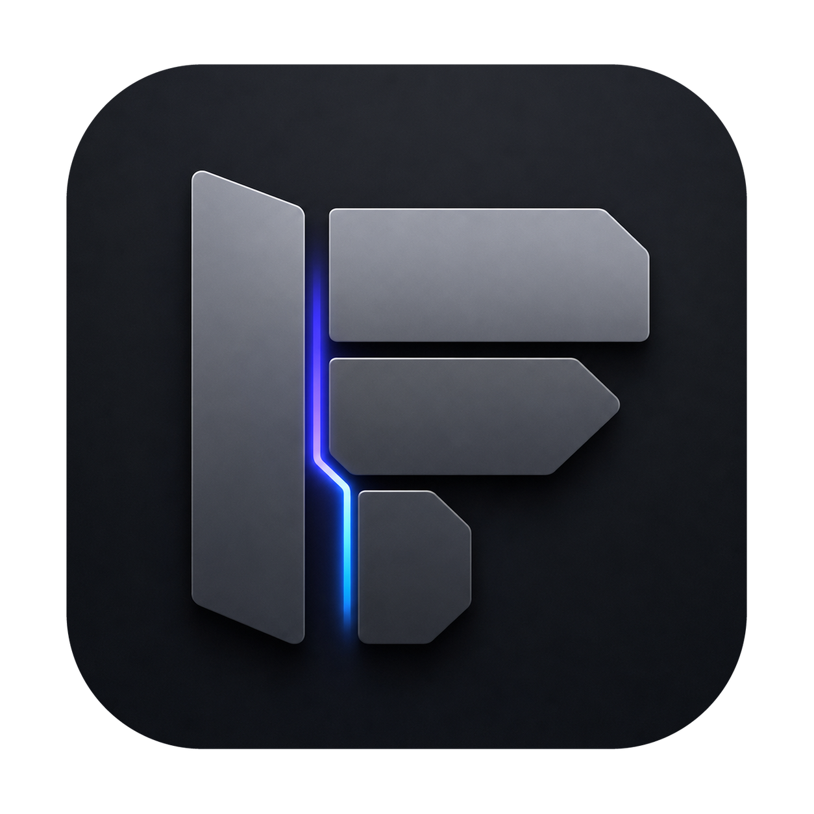

<p align="center">
  
</p>

<h1 align="center">ForgePad</h1>

<p align="center">
  A desktop workspace for AI-assisted coding, bringing terminals, files, diffs, context, and agent sessions into one focused app.
</p>

<p align="center">
  <a href="./README.zh-CN.md">中文文档</a>
</p>

## Highlights

- **AI coding workspace**: Manage projects, worktrees, regular terminals, and AI coding tool terminals in one interface.
- **File and diff preview**: Browse the file tree, inspect code, review Git changes, and select context directly.
- **Context basket**: Build context bundles from files, diffs, code selections, comments, and task notes, then send them to the active terminal workflow.
- **Workspace settings**: Configure themes, pet overlay behavior, run commands, terminal behavior, and workspace preferences.
- **Two desktop shells**: Electron is the primary desktop shell, with Tauri support maintained in the same codebase.

## Main Areas

ForgePad is organized around three main areas:

- **Left workspace panel**: Projects, worktrees, tasks, terminals, and app settings.
- **Center workspace**: Terminal tabs, agent sessions, file preview, Markdown preview, and diff views.
- **Right resource panel**: File tree, Git changes, context basket, and related actions.

## Requirements

- Node.js 22 or newer.
- pnpm.
- Rust toolchain, only needed for Tauri development or builds.

## Install

```bash
pnpm install
```

`node-pty` is rebuilt automatically during `postinstall`. If the native module needs a manual rebuild:

```bash
pnpm rebuild
```

## Development

Run the Electron app:

```bash
pnpm dev
```

Run the Vite renderer only:

```bash
pnpm vite:dev
```

Run the Tauri app:

```bash
pnpm tauri:dev
```

## Build

Type-check the project:

```bash
pnpm typecheck
```

Build the Electron renderer and main process:

```bash
pnpm build
```

Create a macOS Electron DMG:

```bash
pnpm dist
```

Create an unpacked macOS Electron app directory:

```bash
pnpm dist:dir
```

Build the Tauri app:

```bash
pnpm tauri:build
```

## Useful Scripts

| Command | Description |
| --- | --- |
| `pnpm lint` | Check source files with Biome |
| `pnpm format` | Format source files with Biome |
| `pnpm check` | Run Biome checks |
| `pnpm check:write` | Apply Biome fixes where possible |
| `pnpm vite:build` | Build the renderer |
| `pnpm native:mac:package` | Build the slim native macOS bundle with Rust backend |
| `pnpm native:mac:package:portable` | Build the native macOS bundle with bundled Node backend |

## Project Structure

```text
src/main/       Electron main process
src/preload/    Electron preload bridges
src/renderer/   React renderer app
src-tauri/      Tauri shell and Rust commands
build/          App icons and packaging resources
dist/           Build output
```

## Notes

ForgePad is private application code. Keep generated build output, local worktrees, machine-specific config, and temporary files out of commits unless they are intentionally part of a release artifact.
